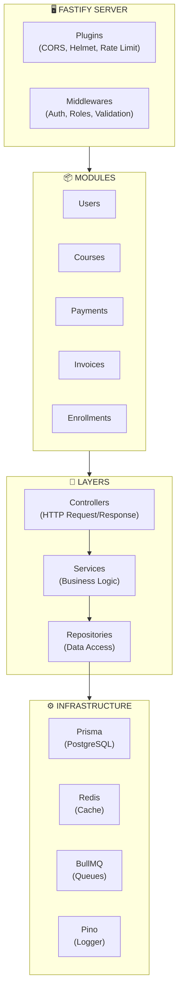

# LMS Backend

A robust Learning Management System (LMS) backend built with **Fastify**, **TypeScript**, **Prisma**, and **PostgreSQL**. This project implements a clean, modular architecture designed for scalability and maintainability.

---

## 📋 Table of Contents

- [LMS Backend](#lms-backend)
  - [📋 Table of Contents](#-table-of-contents)
  - [✨ Features](#-features)
    - [Implemented ](#implemented-)
    - [Planned 🚧](#planned-)
  - [🏗 Architecture](#-architecture)
    - [System Overview](#system-overview)
    - [Layer Responsibilities](#layer-responsibilities)
  - [🛠 Tech Stack](#-tech-stack)
  - [Getting Started](#getting-started)
    - [Prerequisites](#prerequisites)
    - [Installation](#installation)
- [🤝 Contributing](#-contributing)
- [📄 License](#-license)
- [👤 Author](#-author)
- [🙏 Acknowledgments](#-acknowledgments)

---

## ✨ Features

### Implemented 

| Feature | Description |
|---------|-------------|
| **PayFast Payment Webhook** | Complete webhook handler with signature validation, IP verification, and server confirmation |
| **Payment Processing** | Automatic payment record creation and status updates |
| **Invoice Management** | Invoice creation, status tracking, and payment linkage |
| **Course Enrollment** | Automatic course access unlock upon successful payment |
| **Structured Logging** | Pino-based logging with pretty formatting in development |
| **Database Layer** | Prisma ORM with PostgreSQL adapter (Prisma 7+) |
| **Repository Pattern** | Clean data access layer with typed repositories |
| **Service Layer** | Business logic encapsulation with dependency injection |
| **Docker Support** | PostgreSQL and Redis containers via Docker Compose |

### Planned 🚧

| Feature | Description | Status |
|---------|-------------|--------|
| **Authentication & User Management** | JWT-based auth, role-based access control, user profiles | 📋 Planned |
| **WhatsApp Integration** | Course notifications, payment confirmations, chatbot support | 📋 Planned |
| **Background Job Processing** | BullMQ queues for emails, notifications, and async tasks | 📋 Planned |
| **AI Features** | Auto-grading, AI chatbot, RAG-based course assistance | 📋 Planned |
| **Admin Reporting** | Analytics dashboard, revenue reports, user metrics | 📋 Planned |

---

## 🏗 Architecture

This project follows a **modular, layered architecture** that separates concerns and promotes maintainability.

### System Overview



### Layer Responsibilities

| Layer | Responsibility | Example |
|-------|----------------|---------|
| **Routes** | Define endpoints, attach controllers | `POST /api/v1/webhooks/payfast` |
| **Controllers** | Parse request, call service, format response | Validate body, call `paymentService.process()` |
| **Services** | Business logic, orchestrate repositories | Validate signature, update invoice, unlock course |
| **Repositories** | Data access only (Prisma queries) | `findInvoiceByPaymentId()`, `updateEnrollment()` |

---

```markdown
## 📁 Project Structure

LMS-backend/
├── src/
│ ├── app.ts # Fastify app factory
│ ├── server.ts # Entry point (starts server)
│ │
│ ├── config/
│ │ └── index.ts # Environment configuration
│ │
│ ├── modules/ # Feature modules (domain-driven)
│ │ ├── users/
│ │ │ └── user.repository.ts # User data access
│ │ │
│ │ ├── enrollments/
│ │ │ └── enrollment.repository.ts # Enrollment data access
│ │ │
│ │ ├── invoices/
│ │ │ └── invoice.repository.ts # Invoice data access
│ │ │
│ │ └── payments/
│ │ ├── payment.controller.ts # HTTP request handling
│ │ ├── payment.service.ts # Payment business logic
│ │ ├── payment.repository.ts # Payment data access
│ │ ├── payment.routes.ts # Route definitions
│ │ └── payfast/
│ │ ├── payfast.service.ts # PayFast signature validation
│ │ └── payfast.types.ts # PayFast type definitions
│ │
│ ├── shared/ # Shared utilities
│ │ ├── constants/ # Status enums
│ │ ├── types/ # Common types
│ │ ├── errors/ # Custom error classes
│ │ └── utils/ # Helper functions
│ │
│ ├── infrastructure/ # External services
│ │ ├── database/
│ │ │ └── prisma.ts # Prisma client instance
│ │ └── logger/
│ │ └── pino.ts # Pino logger configuration
│ │
│ ├── routes/
│ │ └── index.ts # Route registration
│ │
│ ├── plugins/ # Fastify plugins (future)
│ └── middlewares/ # Custom middlewares (future)
│
├── prisma/
│ ├── schema.prisma # Database schema
│ ├── prisma.config.ts # Prisma configuration (v7+)
│ ├── seed.ts # Database seeding
│ └── migrations/ # Database migrations
│
├── scripts/
│ └── simulate-payfast.ts # PayFast webhook simulator
│
├── docker-compose.yml # PostgreSQL & Redis containers
├── .env # Environment variables
├── .env.example # Environment template
├── package.json
├── tsconfig.json
└── README.md
```

---

## 🛠 Tech Stack

| Category | Technology | Version | Purpose |
|----------|------------|---------|---------|
| **Runtime** | Node.js | 24.x | JavaScript runtime |
| **Language** | TypeScript | 5.9 | Type safety |
| **Framework** | Fastify | 5.x | HTTP server framework |
| **ORM** | Prisma | 7.x | Database ORM |
| **Database** | PostgreSQL | 16 | Primary data store |
| **Cache/Queue** | Redis | 7 | Caching & job queues |
| **Logger** | Pino | 10.x | Structured logging |
| **Dev Runner** | tsx | 4.x | TypeScript execution |
| **Hot Reload** | nodemon | 3.x | Development hot reload |

---

##  Getting Started

### Prerequisites

- **Node.js** 20+ (recommended: 24.x)
- **Docker** & **Docker Compose**
- **npm** or **yarn**

### Installation

1. **Clone the repository**
   ```bash
   git clone https://github.com/yourusername/lms-backend.git
   cd lms-backend

2. **Install dependencies**
   ```bash
   npm install

3. **Set up environment variables**
   - Copy `.env.example` to `.env` and fill in the required values.

4. **Start PostgreSQL and Redis with Docker Compose**
   ```bash
    docker-compose up -d

5. **Run database migrations**
   ```bash
   npx prisma migrate dev --name init

6. **Seed the database**
   ```bash
   npm run seed

7. **Start the development server**
   ```bash
    npm run dev

The server should now be running at `http://localhost:3000`.


## ⚙️ Configuration
Environment Variables
Create a .env file in the project root:

PayFast Sandbox Credentials
For testing, use PayFast's sandbox credentials:

Merchant ID: 10000100
Merchant Key: 46f0cd694581a
Passphrase: jt7NOE43FZPn

## 📡 API Endpoints

Current Endpoints

| Method | Endpoint                 | Description                     |
| ------ | ------------------------ | ------------------------------- |
| GET    | /health                  | Server health check             |
| GET    | /api/v1/webhooks/health  | Health webhook endpoint         |
| POST   | /api/v1/webhooks/payfast | PayFast payment webhook handler |

Response Format
All responses follow a consistent format:
```json
{
  "success": true,
  "data": { ... },
  "message": "Operation completed successfully"
}
```

Error responses:
```json
{
  "success": false,
  "error": "Error type",
  "message": "Detailed error message"
}
```

💳 PayFast Integration
How It Works: 
User initiates payment → Frontend redirects to PayFast checkout
PayFast processes payment → User completes payment on PayFast
PayFast sends ITN webhook → POST /api/v1/webhooks/payfast
Backend validates & processes:
✅ Validates MD5 signature
✅ Verifies merchant ID
✅ Checks source IP (production only)
✅ Prevents duplicate processing
✅ Updates payment record
✅ Updates invoice to PAID
✅ Unlocks course access

# 🤝 Contributing
Contributions are welcome! Please follow these steps:

1.  Fork the repository
2.  Create a feature branch (git checkout -b feature/amazing-feature)
3.  Commit your changes (git commit -m 'Add amazing feature')
4.  Push to the branch (git push origin feature/amazing-feature)
5.  Open a Pull Request


Code Style
-   Use TypeScript strict mode
-   Follow the existing project structure
-   Write meaningful commit messages
-   Add appropriate logging
-   Update documentation as needed


# 📄 License
This project is licensed under the ISC License.

# 👤 Author

**Dan A. Tshisungu**

GitHub: [My github Profile](https://github.com/WeOnlyLiveOnce13)
LinkedIn: [Dan's LinkedIn](https://www.linkedin.com/in/dan-tshisungu-5772a3168/)


# 🙏 Acknowledgments
-   Fastify - Fast and low overhead web framework
-   Prisma - Next-generation ORM
-   PayFast - Payment gateway
-   Pino - Super fast Node.js logger
